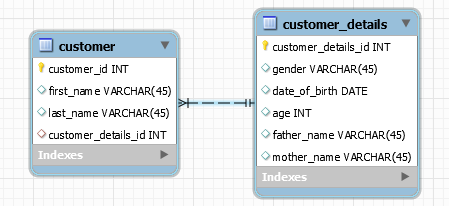
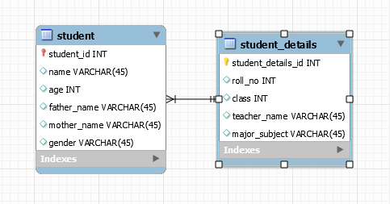

# Hibernate Mapping One-To-One -- BiDirectional

A Sample Hibernate mapping application

## 1. Using Foreign key Association

    
   Here a foreign key column is created in owner entity. Relationship owing entity is 'Customer' and 'CustomerDetails' is the target entity. Both should contain **@OneToOne** annotation. Owning entity should have **@JoinColumn** with column name and referenced column name (primary key in the target entity) of the target entity.  The target entity should also specify mappedBy attribute to specify field in the owning entity. **mappedBy** always present at the non-owning side of the mapping

## 1. Using Shared Primary Key Association

	Here we have used new feature introduced in JPA 2 to share primary key for both entities for a association. Relationship owing entity is 'Student' and 'StudentDetails' is the target entity. Both should contain **@OneToOne** annotation. 
	Owning entity should have **@JoinColumn** with column name(will be primary key for the owning entity) and referenced column name (primary key in the target entity). And also there is no need for separate 'id' column in the owning entity as we have to mention **@Id** in the target associating field(in this case it is studentDetails).
	As key is generated at the target entity we have to persist target entity instead of owning entity.