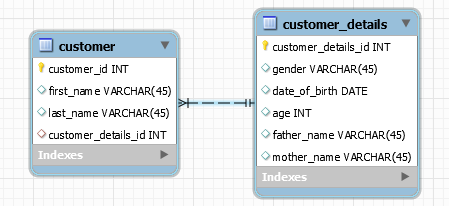

# Hibernate Mapping One-To-One

A Sample Hibernate mapping application

## 1. Using Foreign key Association
    
   Here a foreign key column is created in owner entity. Relationship owing entity is 'Customer' and 'CustomerDetails' is the target entity. Both should contain **@OneToOne** annotation. Owning entity should have **@JoinColumn** with referenced column name (primary key in the target entity) of the target entity...
   The target entity should also specify mappedBy attribute to specify field in the owning entity. **mappedBy** always present at the non-owning side of the mapping
